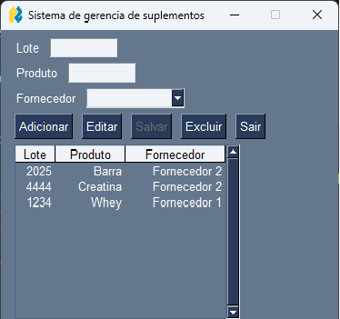

## Projeto faculdade interface gráfica

# 📚 Visão Geral
Este projeto é uma aplicação simples em Python para cadastro, edição, exclusão e visualização de suplementos, utilizando interface gráfica com PySimpleGUI e banco de dados SQLite.

# ✨ Funcionalidades
Cadastro de suplementos (Lote, Produto, Fornecedor)

Edição de registros existentes

Exclusão de registros

Visualização dos dados em tabela

Dados persistidos em banco SQLite (banco_db.sqlite)

# Interface do projeto

